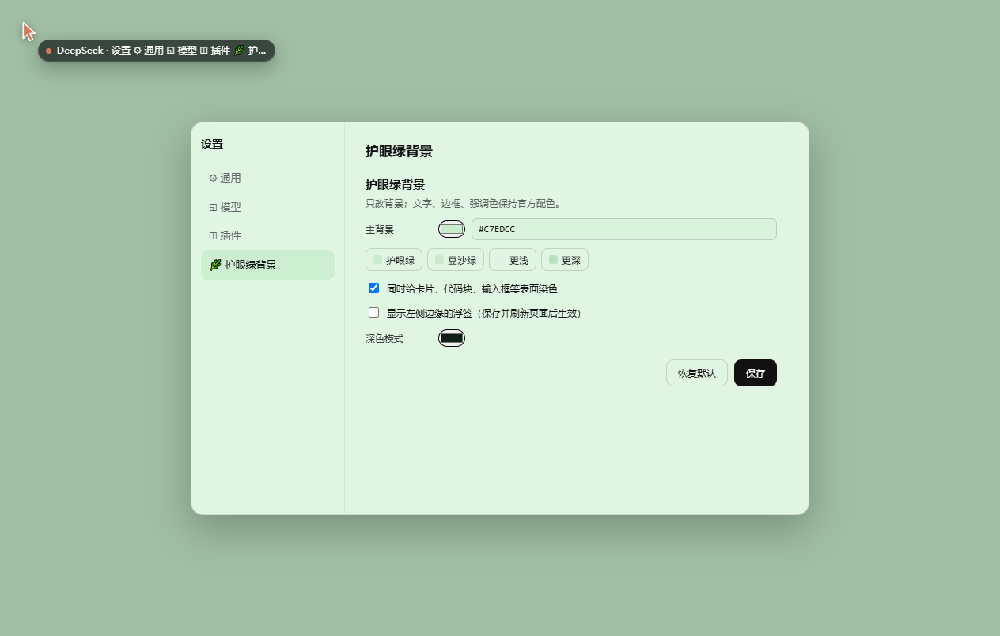
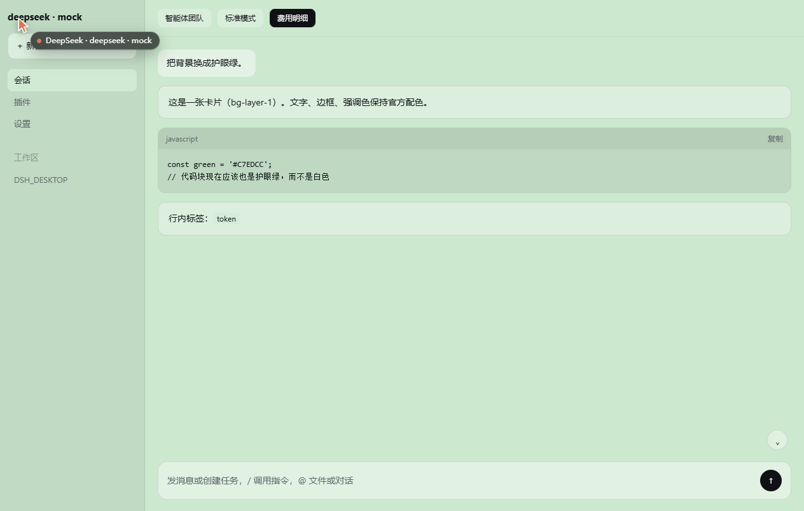

# dsh-eyecare-bg

把 DSH（Web / 桌面版）的背景换成**护眼绿**的极小插件，自带一个设置面板。

- **只改背景**：画布、卡片、侧栏、菜单/弹层、输入框、代码块与代码顶栏、状态条、浮层按钮——凡是官方浅色主题里会解析成白色的表面都在内。文字、边框、强调色、字体、字号、圆角、布局、阴影全部保持官方原样。
- **零依赖**：`dependencies` 为空，不装任何换肤插件。
- **不改 app.asar**：宿主半边向 index.html 注入样式与面板脚本，客户端半边只往官方槽位注册一个设置分区。
- **不需要构建**：客户端 bundle 是手写的，但走官方运行时协议（`__ModuleLoader__.load` 的 factory 形式），只 `require` 平台模块 `react`，因此不需要 tsdown/Vite、也不需要 `pnpm run build`。
- **不写 localStorage**：配置落在 `$DSH_HOME/eyecare-bg.json`。




> 两张预览都是**按宿主结构模拟渲染**的（左：设置弹窗壳；右：对话页壳），不是真实应用截图——
> 用来展示配色关系与面板形态。

## 它为什么能生效

DSH 的界面颜色全部走 `--dsw-*` 设计 token。关键在于 token 是**怎么下发**的：
`@deepseek-ai/dsh-client-ui-layout` 的 presenter 在 `apply(snapshot)` 里逐个执行
`body.style.setProperty(name, value)`——**内联样式**。内联样式在层叠里只输给带
`!important` 的作者声明，所以任何普通样式表都改不动它。

本插件挂宿主网页服务器的 index 注入钩子：

```js
ctx.on('webserver/index-inject', (table) => {
  table.push({ kind: 'style', text: themeCss + MARKER }); // 主题 token 覆盖，可被面板认领后关掉
  table.push({ kind: 'style', text: panelCss });          // 面板壳样式，永远不禁用
  table.push({ kind: 'script', placement: 'body', text: panelScript });
});
```

两个样式行是**故意分开**的：面板接管后会把自己那份主题样式 `disabled` 掉（否则「关掉表面染色」这类收窄改动会被旧声明压住），而面板自己的按钮/间距样式必须留着。合成一行就会把壳样式一起关掉——这个坑实测踩过一次。

`kind: 'style'` 的行由 `@deepseek-ai/dsh-host-webserver` 的 `renderRow()` 固定渲染进
`<head>`，`kind: 'script'` 的行插在 `<body>` 开头；样式里每条声明都带 `!important`，
于是它高过 body 上的内联 token。

## 覆盖了哪些 token

`SURFACE_TOKENS` 里那张表有 **31 项**，取值来自对官方 `design-platform.css` 的实测解析：
下面每一条在官方浅色主题里都解析为 `#fff` / `#f9fafb` / `#f5f6f7` / `#f1f3f5` /
`#ebeef2` / `#e9ecf2` 之一，也就是绿底上仍然会发白的表面。

每项是 `[token, 浅色比例, 深色比例]`：正数往白里提（纸面/抬起），负数往黑压（下沉/内嵌）。
深浅两套各自插值，所以同一个 token 在深色模式下会自动往亮里走。

几个直观的例子（底色 `#C7EDCC` 时）：

| token | 用途 | 结果 |
|-------|------|------|
| `--dsw-alias-bg-base` | 主画布 | `#C7EDCC` |
| `--dsw-alias-bg-layer-1` | 卡片 | `#D9F3DC` |
| `--dsw-specific-sidebar-fill` | 侧栏 | `#BBDFC0` |
| `--dsw-alias-markdown-code-block` | **代码块** | `#B9DCBE`（下沉一档） |
| `--dsw-alias-markdown-code-block-banner` | 代码块顶栏 | `#B1D3B6` |
| `--dsw-specific-input-major` | **输入框** | `#DFF5E1` |
| `--dsw-specific-bubble` | 消息气泡 | `#E0F5E3` |

## 设置面板

**一份实现，三个入口**：

1. **DSH 设置页里的「护眼绿背景」分区**（首选）。左侧栏底部点设置 → 导航栏里多出一项。
   这是官方的一等扩展点，走 `settings.section` 槽位：

   ```js
   ctx.slots.inject('settings.section', () => ctx.slots.register({
     name: 'settings.section',
     id: 'eyecare-bg',
     order: 40,
     label: () => '护眼绿背景',
   }, EyecareSection));
   ```

   侧栏导航就是 `ctx.slots.entries("settings.section")` 按 `order` 排出来的，点子项时
   shell 用 `renderSlot("settings.section", { close }, { only: active })` 渲染对应 id 的条目
   —— 所以宿主一行都不用改。`EyecareSection` 自己只画一个空 `<div>`，真正的表单由宿主半边
   `window.__EYECARE_BG__.mount(container)` 挂进去，于是设置页与浮层永远是同一份实现。

2. **页面左侧边缘的小色块标签**（`top:44%`，平时半透明、悬停变清晰）——随手入口，
   点开是居中模态。不想要它就在配置里写 `tab: false`。

3. **`http://127.0.0.1:19387/eyecare-bg`** —— 独立页面版，任意本机浏览器都能打开。
   webserver 本身没有认证层，插件自己拥有的路由自带回环 Host + 同源校验
   （`sec-fetch-site: cross-site` 与跨源 Origin 一律 403）。

面板内容：取色器 + 十六进制输入框、4 个预设（护眼绿 / 豆沙绿 / 更浅 / 更深）、
「表面染色」开关、深色模式取色器、恢复默认 / 保存。

改色是**实时预览**的：面板把 API 返回的样式写进自己的 `<style id="eyecare-bg-live">`，
并凭注入样式里的 `/*eyecare-bg*/` 标记把随 index 注入的那份**关掉**（`style.disabled = true`），
因此像「关掉表面染色」这种*收窄*型改动也能立刻生效，不必刷新页面。标记只出现在注入行里，
不会误伤应用自己的 token 样式表。

客户端半边整段包在 `try/catch` 里：槽位条目不合格时 SlotCore 会抛，但那只是这一块界面不出现，
绝不该影响宿主自己的设置页。`dsh.client` 不声明任何 `inject`（即不请求平台表之外的提供方），
所以组合阶段不会因为缺提供方而拒绝这个 bundle。

## 配置

优先级：**内置默认 ← profile 的 `cordis.patch.yml` config ← `$DSH_HOME/eyecare-bg.json`**。
文件优先，所以面板改过之后 YAML 不会把它顶回去；「恢复默认」是删掉文件、退回 YAML。

```yaml
# $DSH_HOME/profiles/desktop/cordis.patch.yml
- id: eyecare-bg
  config:
    color: "#C7EDCC"       # 浅色模式背景色（#rgb / #rrggbb）
    colorDark: "#0F2116"   # 深色模式背景色
    surfaces: true         # false = 只染主画布，卡片与代码块回到官方配色
    tab: true              # false = 不显示左侧边缘那个浮签（只留设置页入口）
```

其它常用护眼绿：`#CCE8CF`（更柔）、`#E3F0E4`（更浅）、`#B7E3BE`（更深）。

配置写错（比如 `color: green`）**不会**让插件失效，也不会连累 profile：`apply()` 捕获后回退到
默认护眼绿，并在宿主日志留一行 `[eyecare-bg] 配置不可用（…），已回退到默认护眼绿。`

### HTTP 接口

| 方法 | 路径 | 说明 |
|------|------|------|
| GET | `/eyecare-bg/api/config` | 返回 `{ ok, config, css }` |
| POST | `/eyecare-bg/api/config` | `{ config }` 保存；`{ config, preview: true }` 试算不落盘；`{ reset: true }` 恢复默认 |
| GET | `/eyecare-bg` | 设置页面 |
| GET | `/eyecare-bg/panel.js` | 面板模块（客户端 bundle 在拿不到注入的全局时按需补拉） |

请求体上限 64 KiB；非法颜色返回 400 并带上人类可读的原因。

## 安装

> 桌面版的 `desktop` profile 只认两种装法：应用内的插件管理界面，或**安装包自己捆绑的 CLI**
> `resources\runtime\cli\bin\dsh.cmd`（它带 `manageDesktopProfile` 权限）。
> 外部 dsh CLI 会被直接拒绝：`profile "desktop" is managed exclusively by the Electron application`。

**方式 A · 应用内**：左侧栏 → **插件** → **添加插件** → 粘贴本仓库的本地绝对路径。

**方式 B · 捆绑 CLI**（`<DSH 安装目录>` 换成你自己的）

```powershell
& '<DSH 安装目录>\resources\runtime\cli\bin\dsh.cmd' plugin --profile desktop add `
  '<本仓库的绝对路径>'
```

它以 `link:` 方式挂进 profile 的 `node_modules`（junction），所以改完 `host.js`
**重启桌面版**即可生效，不需要重装。

### 回滚

```powershell
& '<DSH 安装目录>\resources\runtime\cli\bin\dsh.cmd' plugin --profile desktop remove dsh-eyecare-bg
```

装/卸都不会影响其它 bundle：`loadProfileDirectory()` 对每条 bundle 单独 try/catch，解析失败只会
进 `skippedBundles` 并在 stderr 留一行，**其余 bundle 照常装载、应用照常启动**。

## 自检

```bash
node test/verify.mjs            # 51 项：挂载契约、表面覆盖、注入标记卫生、配置、HTTP 路由层、客户端 bundle
node test/serve.mjs 19488       # 本地夹具：/demo 模拟宿主 index，/settings 模拟设置弹窗，/eyecare-bg 是设置页
```

`verify-installed.mjs` 与 `post-install-health.mjs` 要读**真实的 profile 目录**，用 DSH 自己注入的
环境变量即可（在 DSH 的 shell 里天然存在），也可以显式指定：

```bash
DSH_PROFILE_DIR="$DSH_HOME/profiles/desktop" node test/verify-installed.mjs
node test/post-install-health.mjs "$DSH_HOME/profiles/desktop"
```

`verify.mjs` 里的 HTTP 用例用的是与宿主同形状的假 `req`/`res`，跑的是真实处理函数；
客户端 bundle 那组用假的 `__ModuleLoader__` 与 React 桩把 `client.js` **真实物化**一遍，
断言它注册的槽位名/字段和「渲染完才 mount、卸载会清理」；
`serve.mjs` 则把插件按宿主的方式挂到真实 HTTP 服务器上，用于浏览器里目视核对。
